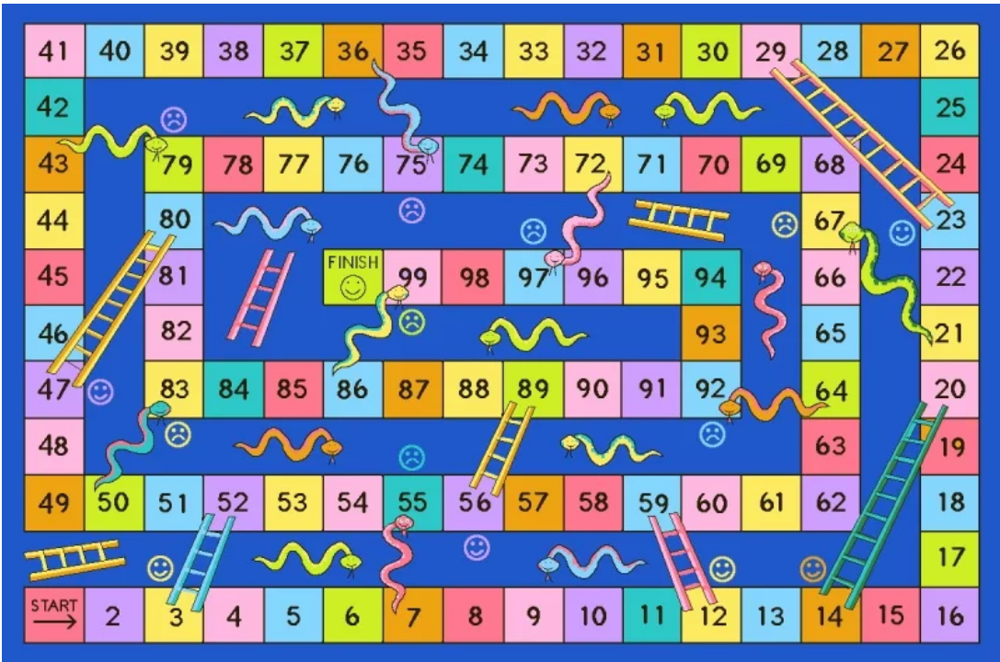

# Ejercicio 4: Serpientes y Escaleras

> Primera Parcial

- FACULTAD DE TELEMATICA
- INGENIERÍA EN SOFTWARE
- “3ºG”
- ESTRUCTURA DE DATOS
- CATEDRATICO: RAMIREZ GONZALEZ HUMBERTO
- AGUIRRE ROMERO RAMÓN ALEJANDRO

## OBJETIVO

Simular la ejecución del juego de serpientes y escaleras en un tablero de 100 casillas, con dos jugadores

> ENTREGA: VIERNES 10 DE SEPTIEMBRE DEL 2021

## EXPLICACIÓN DEL PROCESO

Simular la ejecución del juego de serpientes y escaleras en un tablero de 100 casillas, con dos jugadores, distribuir a su consideración entre 8 y 10 serpientes y entre 8 y 10 escaleras dentro del tablero.

Considerar el modo de juego simple que es donde un jugador con llegar o pasar de 100 gana (no deberá regresar las casillas extras al 100)

Utilizar clases para los elementos que se requieren para el juego.
